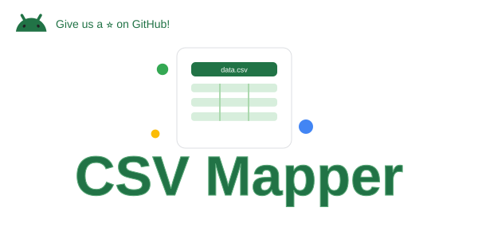
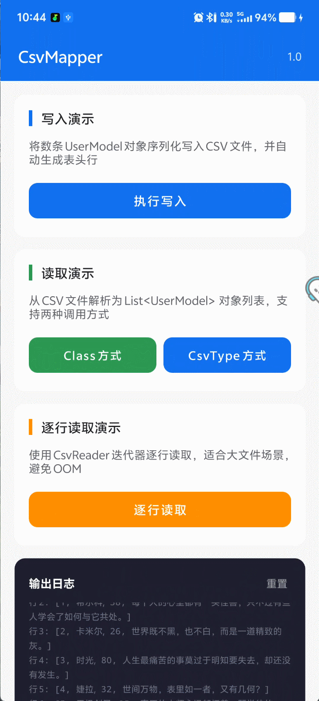

# CsvMapper（CSV 对象映射框架）

<div align="center">
  
</div>


## 一、模块简介
CsvMapper 是一个给 Android 项目用的 CSV 文件读写与对象映射框架。

框架通过注解驱动的方式统一定义对象与 CSV 之间的映射关系，读写过程都会基于这些映射规则进行处理；在框架底层，
基于 **[有限状态机（FSM）](doc/ARCHITECTURE.md#二finite-state-machine有限状态机)** 实现的解析流程，并严格遵循了 RFC 4180 规范。

- **[RFC 4180 官方文档](https://datatracker.ietf.org/doc/html/rfc4180)**
- **[RFC 4180（Apifox 中文文档）](https://docs.apifox.com/csv)**

同时，CsvMapper 也提供了对泛型比较友好的读写 API。

在平时处理 CSV 相关功能时，经常会遇到这些问题：

- 手写 `split(",")` 遇到引号、逗号嵌套或者换行，解析结果立刻错位
- 对象与 CSV 行之间的映射关系，需要手动维护，改个字段就可能出 bug
- 文件稍微大一点，一次性 `readAllLines()` 全读进内存，很容易 OOM

所以 CsvMapper 做的，就是把这些问题统一抽象掉，统一收敛成一套稳定的处理方式。

---

### 1. 效果预览
<div align="left">
  
</div>

下载体验：[release-csv-mapper-V1.0.apk](doc/apk/release-csv-mapper-V1.0.apk)

---

### 2. 架构设计与 FSM 核心原理

详见 [ARCHITECTURE.md](doc/ARCHITECTURE.md)，包含分层架构图与 FSM 状态机原理解析。

---

## 二、核心能力

- 解析层完全兼容 **[RFC 4180（中文）](https://docs.apifox.com/csv)** 标准，支持引号、换行和特殊字符，不会因复杂格式出错。

- 通过 `@CsvColumn` 实现对象自动映射，写入支持设置最大字符数和截断等格式控制。

- 大文件场景下提供逐行迭代器，不必担心 OOM。

- 可通过 `CsvFieldMapper` 接口接入自定义转换逻辑，反射元数据会在首次解析后缓存，同类型反射不会重复开销。

---

## 三、SDK 适用范围

Min SDK 19（Android 4.4）及以上

---

## 四、集成方式

### 1. 添加仓库地址

```groovy
maven { url 'https://jitpack.io' }
```

### 2. 添加依赖

```groovy
implementation 'com.github.starseaway:csv-mapper:1.0.0'
```

```kotlin
implementation("com.github.starseaway:csv-mapper:1.0.0")
```

---

## 五、使用教程

### 1. 定义数据模型

用 `@CsvColumn` 声明字段与 CSV 列的映射关系，支持按列名或列索引绑定：

```java
package com.xinyi.app.csvmapper.model;

import androidx.annotation.NonNull;

import com.xinyi.csvmapper.annotation.CsvColumn;

/**
 * 用户数据模型（测试）
 *
 * <p> 展示框架的注解驱动对象的读写能力，通过 {link CsvColumn} 注解声明字段与 CSV 列的映射关系 </p>
 *
 * @author 新一
 * @date 2026/4/23 17:39
 */
public class UserModel {

    /**
     * 用户 ID
     */
    @CsvColumn(name = "id", index = 0)
    private int id;

    /**
     * 用户名
     */
    @CsvColumn(name = "name", index = 1)
    private String name;

    /**
     * 年龄
     */
    @CsvColumn(name = "age", index = 2)
    private int age;

    /**
     * 座右铭
     *
     * <p> 可以选择设置最大长度和超出时的截断符号：maxLength = 20, truncateSuffix = "…" </p>
     */
    @CsvColumn(name = "motto", index = 4)
    private String motto;

    /**
     * 无参构造函数
     *
     * <p> 注解映射时框架通过反射调用此构造函数创建实例，必须保留 </p>
     */
    public UserModel() { }

    /**
     * 构造函数
     *
     * @param id 用户 ID
     * @param name 用户名
     * @param age 年龄
     * @param motto 座右铭
     */
    public UserModel(int id, String name, int age, String motto) {
        this.id = id;
        this.name = name;
        this.age = age;
        this.motto = motto;
    }

    public int getId() {
        return id;
    }

    public String getName() {
        return name;
    }

    public int getAge() {
        return age;
    }

    public String getMotto() {
        return motto;
    }

    @NonNull
    @Override
    public String toString() {
        return "{" + "id=" + id + ", name=" + name + ", age=" + age + ", motto=" + motto + "}";
    }
}
```

### 2. 写入 CSV

```java
void testWriterCsv() {
    List<UserModel> users = new ArrayList<>();
    // 填充数据
    // users.add

    // 泛型类型令牌方式，类型明确
    CsvMapper.serialize(file, users, new CsvTypeToken<List<UserModel>>() { });
    
    // 从第一个元素运行时类型推断
    CsvMapper.serialize(file, users);
}
```

生成结果：

```
id,name,age,motto
1,希尔科,38,每个人的心里都有一头怪兽，只不过有些人学会了如何与它共处。
2,卡米尔,26,世界既不黑，也不白，而是一道精致的灰。
3,时光,80,人生最痛苦的事莫过于明知要失去，却还没有发生。
4,婕拉,32,世间万物，表里如一者，又有几何？
5,无极剑圣,35,真正的大师永远都怀着一颗学徒的心。
6,艾克,18,时间不在乎你拥有多少，而在于你如何使用。
7,深海泰坦,42,倘若你迷失在黑暗之中，除了前行别无他法。
8,塔里克,33,我曾踏足山巅，也曾进入低谷，二者都让我受益良多。
9,佐伊,14,时光啊就像潮水，它送来了一切，也会带走一切。
```

### 3. 读取 CSV

```java
// 泛型类型令牌（完整类型信息，支持复杂泛型）
List<UserModel> users = CsvMapper.parse(file, new CsvTypeToken<List<UserModel>>() { });

// 指定 Class 单一对象类型
List<UserModel> users = CsvMapper.parse(file, UserModel.class);
```

自定义解析配置：

```java
CsvConfig config = new CsvConfig.Builder<>()
    .delimiter(';') // 分号分隔
    .charset(StandardCharsets.UTF_8) // UTF-8 编码
    .skipHeader(true) // 跳过表头
    .trimWhitespace(true) // 自动 trim 字段空白
    .forceQuoteAll(true) // 所有字段强制加引号
    .build();

List<UserModel> users = CsvMapper.parse(file, UserModel.class, config);
// CsvMapper.parse(file, new CsvTypeToken<List<UserModel>>() { }, config);
```

> 泛型类型令牌原理是通过匿名子类把泛型信息 “保存在字节码里”，再通过反射读取出来。
> `CsvTypeToken` 与 Gson 的 `TypeToken`、Fastjson 的 `TypeReference` 原理完全一致。

### 4. 逐行读取（大文件场景）

大文件不要用 `parse()` 一次性加载，建议用迭代器逐行处理：

```java
void testReadNextLine() {
    try (CsvReader reader = CsvMapper.reader(file)) {
        // 手动读取表头行
        CsvRow header = reader.readNextRow();

        // 逐行读取数据行
        CsvRow row;
        while ((row = reader.readNextRow()) != null) {
            // 支持按 列名 或者 列索引 获取当前数据
            String name = row.get("name");
            String id = row.get(0);
        }
    } // catch
}
```

### 5. 自定义字段类型转换器

内置支持常见基础类型，其他类型可以通过实现 `CsvFieldMapper` 接口：

```java
public class DateFieldMapper implements CsvFieldMapper<Date> {

    private final SimpleDateFormat sdf = new SimpleDateFormat("yyyy-MM-dd HH:mm:ss");

    @Override
    public Date convert(String rawValue) {
        try {
            return rawValue == null ? null : sdf.parse(rawValue);
        } catch (ParseException exception) {
            throw new CsvMappingException("日期格式错误: " + rawValue, exception);
        }
    }
}
```

使用时在 `@CsvColumn` 上指定：

```java
@CsvColumn(name = "created_at", mapper = DateFieldMapper.class)
private Date createdAt;
```

### 6. 底层 API

需要精细控制时，可以直接操作底层读写器：

```java
void testCsvMapper() {
    // 读取器
    try (CsvReader reader = CsvMapper.reader(inputStream, config)) {
        List<CsvRow> rows = reader.readAllRows();
        List<String> header = reader.getHeader();
    } // catch

    // 写入器
    try (CsvWriter writer = CsvMapper.writer(outputStream, writeConfig)) {
        writer.writeHeader(Arrays.asList("id", "name", "age"));
        writer.writeRow("1", "张三", "24");
    } // catch

    // 注解驱动读取器（逐条处理）
    try (AnnotationCsvReader<UserModel> reader = CsvMapper.objectReader(file, UserModel.class)) {
        UserModel user;
        while ((user = reader.readNext()) != null) {
            LogUtil.d("name = " + user);
        }
    } // catch

    // 注解驱动写入器
    try (AnnotationCsvWriter<UserModel> writer = CsvMapper.objectWriter(file, UserModel.class)) {
        writer.writeHeader();
        writer.writeAll(users);
    } // catch
}
```

---

## 六、版本变更记录

### V1.0.0 (2026-04-30)

- 正式开源发布，首个版本主要包含 CSV 读写、注解对象映射、泛型类型令牌等核心能力。
