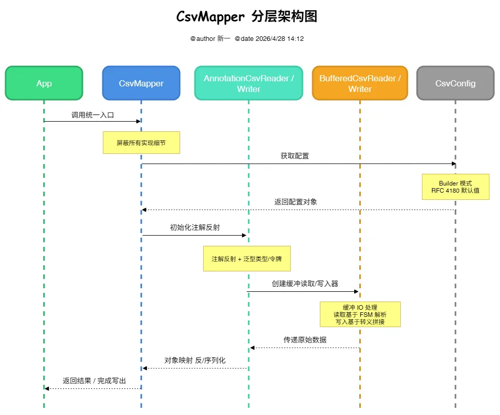
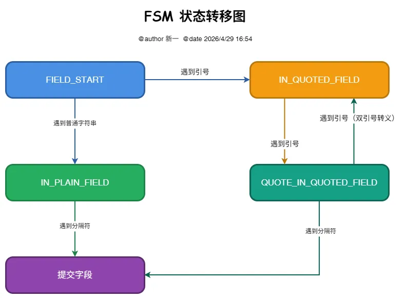

# CsvMapper 架构设计与 FSM 核心原理

## 一、分层架构图

| 分层      | 组件                           |
|---------|------------------------------|
| 门面入口层   | CsvMapper                    | 
| 泛型绑定层   | AnnotationCsvReader / Writer | 
| 读写器层    | BufferedCsvReader / Writer   |
| CSV 配置层 | CsvConfig / CsvWriteConfig   |

## 二、Finite State Machine（[有限状态机](https://cn.bing.com/search?q=有限状态机)）

### 1. 状态转移图

CsvMapper 解析采用有限状态机来设计，思路是：逐字符读入，根据当前状态和当前字符决定下一步动作。

### 2. 各状态的处理逻辑

**FIELD_START**（字段起始）
* 遇到 `"` 进入 `IN_QUOTED_FIELD`
* 遇到 `,` 提交空字段，保持 `FIELD_START`
* 遇到 `换行` 提交空字段，行结束
* 遇到 `其他字符` 写入缓冲区，进入 `IN_PLAIN_FIELD`

**IN_PLAIN_FIELD**（无引号包裹的普通字段）
* 遇到 `,` 提交字段，回到 `FIELD_START`
* 遇到 `换行` 提交字段，行结束
* 遇到 `其他字符` 继续写入缓冲区

**IN_QUOTED_FIELD**（引号字段）
* 遇到 `"` 进入 `QUOTE_IN_QUOTED_FIELD`
* 遇到 `换行` 将换行符写入缓冲区（允许跨行），继续读取
* 遇到 `其他字符` 继续写入缓冲区

**QUOTE_IN_QUOTED_FIELD**（引号内遇到引号）
* 再次遇到 `"` 写入 `"`（转义），回到 `IN_QUOTED_FIELD`
* 遇到 `,` 提交字段，回到 `FIELD_START`
* 遇到 `换行` 提交字段，行结束
* 遇到 `其他字符` 写入缓冲区，转为 `IN_PLAIN_FIELD`（容错）